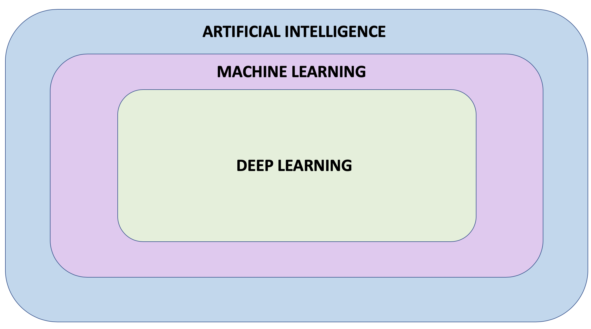

# Artificial intelligence, Machine learning, Neural network, and Deep learning

## Artificial intelligence :
aims to make computers achieve human-style intelligence. There are many ways to reach that goal, including - Machine Learning and Deep learning

## Machine Learning :
A set of related techniques in which computers are trained to perform a particular task rather than by explicitly programming them.

## Neural Network :
A construct "Theory" in Machine Learning inspired by the network of neurons (nerve cells) in the biological brain. Neural networks are a fundamental part of deep learning.

## Deep Learning :
A subfield of machine learning that uses multi-layered neural networks. Often, **“machine learning” and “deep learning”** are used interchangeably.

### Notes :
Machine learning and deep learning also have many subfields, branches, and special techniques. A notable example of this diversity is the separation of Supervised Learning and Unsupervised Learning.
Supervised learning is the most common type of machine learning, and will be the focus of this course.

**supervised learning** you know what you want to teach the computer

**unsupervised learning** is about letting the computer figure out what can be learned. 

# What is Machine Learning?
There are many types of neural network architectures. However, no matter what architecture you choose, the math it contains (what calculations are being performed, and in what order) is not modified during training. Instead, it is **the internal variables (“weights” and “biases”)** which are updated during training.

## For example, in the Celsius to Fahrenheit conversion problem :
the model starts by multiplying the input by some number **(the weight)** and adding another number **(the bias)**. Training the model involves finding the right values for these variables, not changing from multiplication and addition to some other operation.

Machine learning approach conssit of using neural network to learn relationship between input and ouput. You can think of neural network as stack of layers, where each layer consist of some predefined math and internal variables.
The input values are fed into the nerual network and follows through stack of layers. The math and internal variable appllied to it and the result output is produced.

In order for neural network to learn the relationship between inout and output, we have to train it.

We train our neural network by repeatedly letting the network try to map the input to the output. While training, tuning the internal variables in the layers until the network learns to produce the output given the input.
Traing the neural netwrok to turn its internal variables is millions of iuterations over input and output data.

## Colab: Converting Celsius to Fahrenheit

## Some Machine Learning terminology
### **Feature** — The input(s) to our model. In this case, a single value — the degrees in Celsius.
### **Labels** — The output our model predicts. In this case, a single value — the degrees in Fahrenheit.
### **Example** — A pair of inputs/outputs used during training. In our case a pair of values from celsius_q and fahrenheit_a at a specific index, such as (22,72).